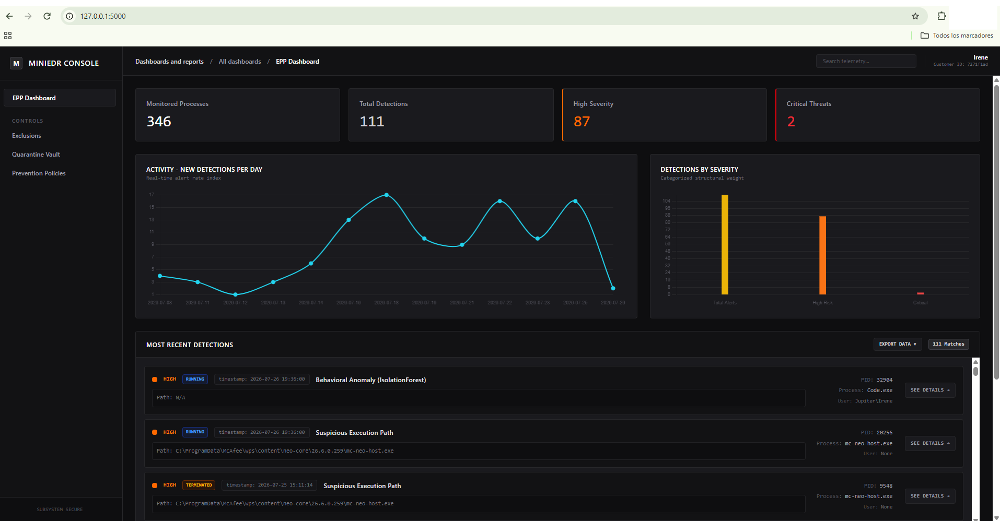
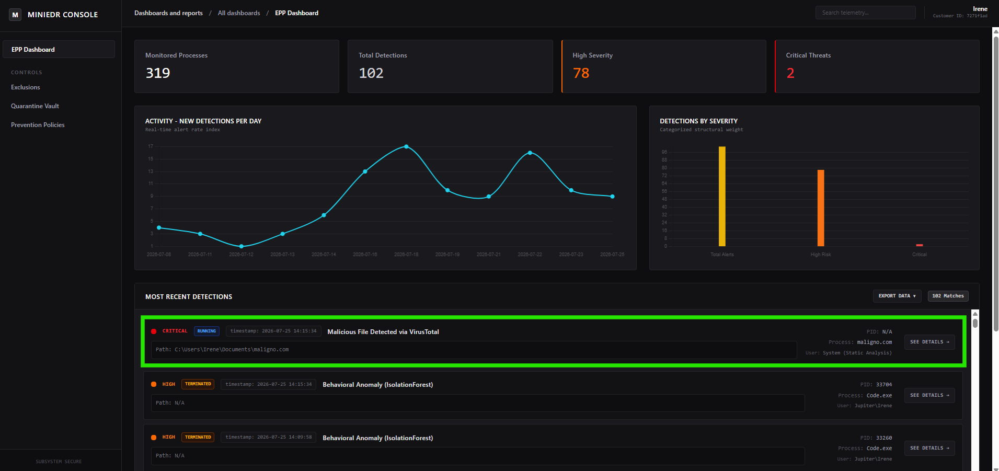
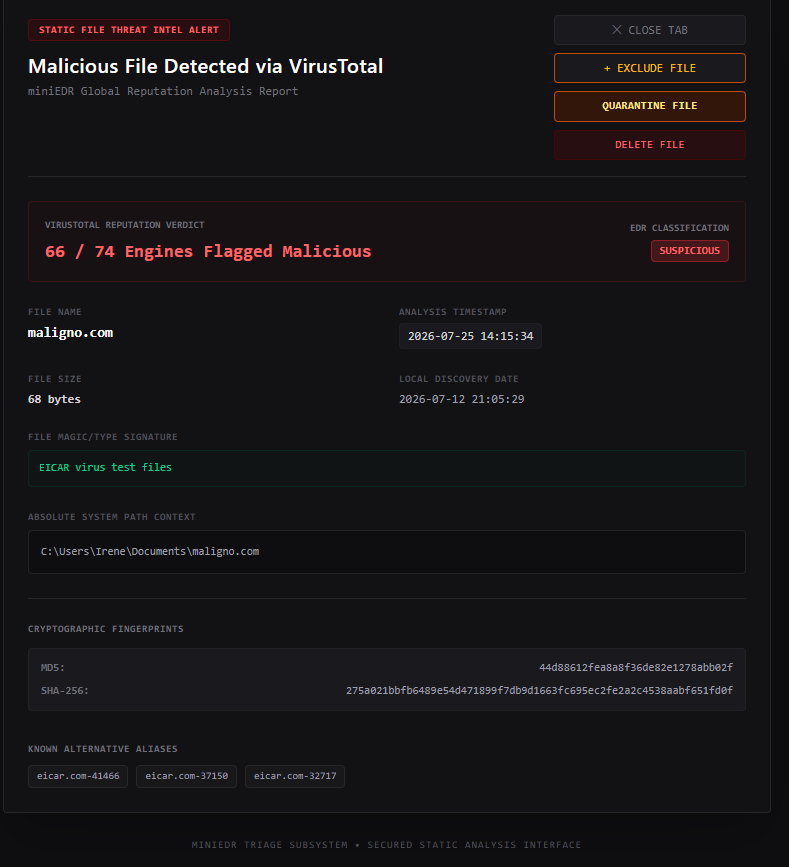
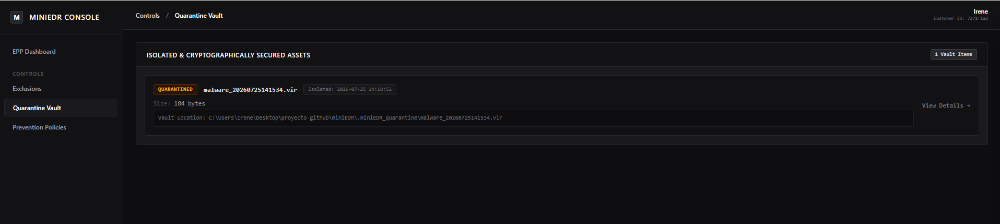
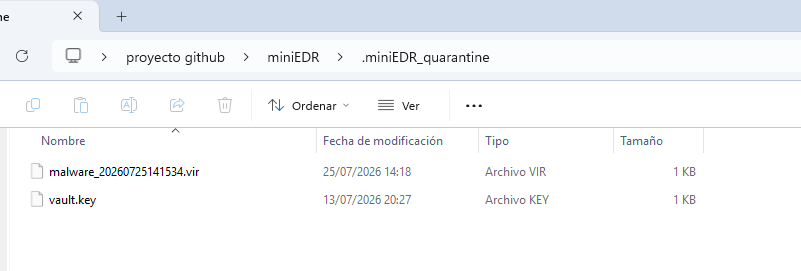
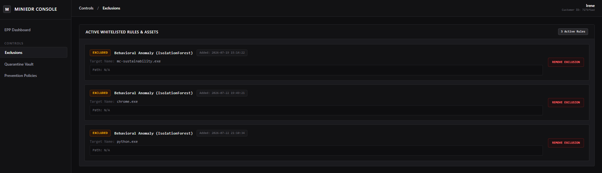

# MiniEDR

**MiniEDR** is a lightweight, modular Endpoint Detection and Response (EDR) solution built with Python and Flask. It collects host process telemetry, runs real-time behavioral anomaly detection using Machine Learning (IsolationForest), enriches file metadata via the VirusTotal API v3, and provides an interactive web dashboard for threat hunting, quarantine isolation, and active remediation.

> **Current Project Status:** Beta / Under Active Development. Tested and validated on **Windows operating systems with SO Windows 11**.



---

## Important Notice: Non-Disruptive / Passive Detection

At its current stage, MiniEDR operates in a **passive observation and analysis mode**. It does **not** take automatic preventive or enforcement actions (such as auto-killing processes or auto-quarantining binaries) upon threat detection. 

All remediation actions (quarantine, process termination, whitelisting) require explicit analyst intervention via the UI. This design ensures **zero risk of system disruption or false positive interference** in production environments while testing.

---

## Features

- **Real-Time Telemetry Collection:** Monitors running system processes, execution paths, CPU/Memory consumption, network connections, and thread ratios using `psutil`.
- **Behavioral Machine Learning Detection:** Implements an unsupervised `Isolation Forest` model (via `scikit-learn`) to detect behavioral process anomalies in real time.
- **VirusTotal Integration & Caching:** Automatically hashes binaries (MD5/SHA-256) and queries VirusTotal API v3 in batch operations, maintaining a local JSON cache to minimize API usage.
- **Cryptographic Quarantine Vault:** Isolates malicious files inside an encrypted (`AES-256 / Fernet`) and permission-restricted hidden vault (`.miniEDR_quarantine`). Supports full restoration and permanent deletion.
- **Interactive Web Dashboard:** Responsive Flask web platform featuring threat distribution charts, real-time alert logs, process metrics, and dedicated forensic drill-down views.
- **Active Response & Exclusion Engine:** Allows security analysts to whitelist false positives, isolate threats, or purge malicious binaries directly from the UI.
- **Data Export:** Supports exporting detections and full host process telemetry in CSV and JSON formats.

---
## User Interface

Here is a quick look at the core interface components of the MiniEDR platform:

#### Dashboard Overview
Overview of host metrics, live threat distribution charts, and real-time process alerts.


---

#### Threat Detection Dashboard View
EPP Dashboard highlighting a critical file detection verified by VirusTotal reputation analysis.


---

#### Forensic Alert Details (Detection State)
Deep-dive inspection view for detected static threats, displaying file hashes, magic signatures, and initial remediation controls (Quarantine / Delete / Exclude).


---

#### Forensic Alert Details (Quarantined State)
Updated forensic triage view showing a verified asset isolated inside the cryptographically encrypted vault.


---

#### Cryptographic Quarantine Vault
Console view managing isolated assets encrypted via AES-256 within the local vault directory.


---

#### Quarantine Vault Directory Structure
File system level view showing the encrypted `.vir` asset along with its associated vault key file inside the hidden `.miniEDR_quarantine` directory.


---

#### Exclusions Manager
Control center for whitelisting safe binaries and behavioral rules to prevent recurring false positives.


## VirusTotal Rate Limit Handling

The VirusTotal Integration operates under the strict rate limits of the **Community/Public API v3 (maximum 4 requests per minute)**. 

To handle this limitation efficiently without freezing the background agent:
- Scanned binary hashes are cached locally in `data/files_telemetry.json` to eliminate duplicate lookups.
- Batch scanning cycles automatically respect the API throttling limits.

---

## Technologies Used

- **Language:** Python 3.10+
- **Web Framework:** Flask (HTML5 / Jinja2 / JavaScript)
- **Data Processing & ML:** `scikit-learn`, `pandas`
- **System Metrics & Hashing:** `psutil`, `hashlib`
- **Threat Intelligence:** VirusTotal API v3 (`requests`, `python-dotenv`)
- **Security & Cryptography:** `cryptography` (Fernet / AES-256)


## Project Structure
```text
miniEDR/
│── docs/
│   └── images/                    # UI Screenshots and diagrams
│── .env                           # Environment variables (VirusTotal API key)
│── .miniEDR_quarantine/           # Hidden AES-256 encrypted quarantine vault
│── data/                          # Data store directory
│   ├── alerts.json                # Generated threat alerts log
│   ├── exclusions.json            # Whitelisted rules and binaries
│   ├── features_dataset.csv       # ML feature extraction history
│   ├── files_telemetry.json       # Scanned files metadata & VT cache
│   └── telemetry.json             # Live host process snapshot
│── src/                           # Core source modules
│   ├── agent.py                   # System process collector
│   ├── app.py                     # Flask web engine and API endpoints
│   ├── enricher.py                # Rule-based threat detection engine
│   ├── file_analyzer.py           # Recursive binary scanner & hasher
│   ├── ml_detector.py             # IsolationForest ML anomaly engine
│   ├── remediations.py            # Cryptographic quarantine & disk operations
│   ├── vt_connector.py            # VirusTotal API v3 integration
│   └── templates/                 # Frontend Jinja2 HTML templates
│       ├── dashboard.html
│       ├── exclusions.html
│       ├── file_alert_details.html
│       ├── process_alert_details.html
│       └── quarantine.html
│── tests/                         # Automated unit test suite
│   ├── test_agent.py
│   ├── test_app.py
│   ├── test_enricher.py
│   ├── test_file_analyzer.py
│   ├── test_ml.py
│   ├── test_remediations.py
│   └── test_vt_connector.py
│── requirements.txt               # Dependencies file
└── README.md
## Installation

### 1. Clone the Repository

```bash
git clone https://github.com/irenemrtinez/miniEDR.git
cd miniEDR
```

### 2. Create a virtual environment (Windows)
```bash
python -m venv venv
.\venv\Scripts\activate
```
### 3. Install the required packages

```bash
pip install -r requirements.txt
```
or
```bash
pip install psutil flask requests python-dotenv cryptography scikit-learn pandas
```
### 4. Configure Environment Variables
Create a .env file in the root directory and add your VirusTotal API Key:
```bash
VT_API_KEY=your_virustotal_api_key_here
```
## Running MiniEDR

Launch the main Flask application engine:

```bash
python src/app.py
```
The application will launch the background monitoring thread and serve the web interface at http://127.0.0.1:5000.

## Running Unit Tests

To run specific component tests or execute the full test suite:

Run a single test module:

```bash
python -m unittest tests/test_enricher.py
```
Discover and run all tests:
```bash
python -m unittest discover -s tests
```

## Future Roadmap & Next Steps

- **Automated Prevention Policies:** Introduce configurable prevention modes (e.g., auto-terminate high-confidence process threats, auto-quarantine flagged binaries) without requiring manual analyst intervention.
- **Enhanced ML Pipeline:** Upgrade the anomaly detection module by evaluating supervised or semi-supervised models (e.g., XGBoost, Random Forest) and engineering deeper process features (parent-child relationship trees, command-line argument analysis).
- **Custom IOC & Signature Rules:** Support custom deterministic detection rules (YARA-style patterns or explicit file hash/IP/domain lists) to instantly flag known threats alongside the ML models.
- **Priority Queueing for VirusTotal:** Optimize the 4 requests/min public API rate limit by implementing a smart priority queue. Newly created binaries or processes executing from high-risk directories (e.g., `AppData\Local\Temp`) will be prioritized over trusted system binaries.
- **Cross-Platform Compatibility:** Expand agent capabilities and filesystem event hooks to support Linux (`/proc` auditing) and macOS environments.

## Contributing

Contributions are welcome :) Feel free to open issues or submit pull requests to improve threat detection rules, UI components, or cross-platform support.

## License

Distributed under the MIT License.